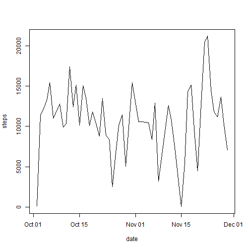
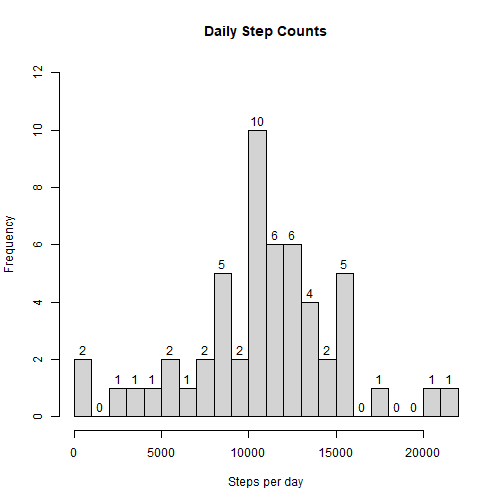
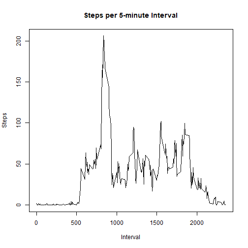
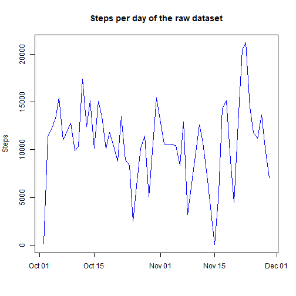
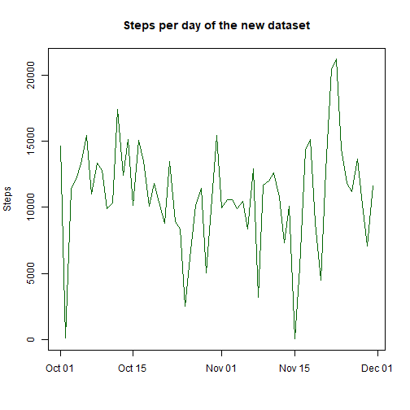
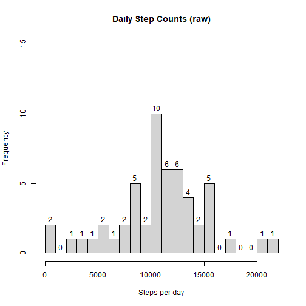
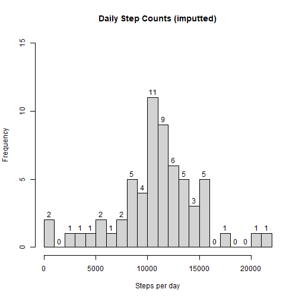
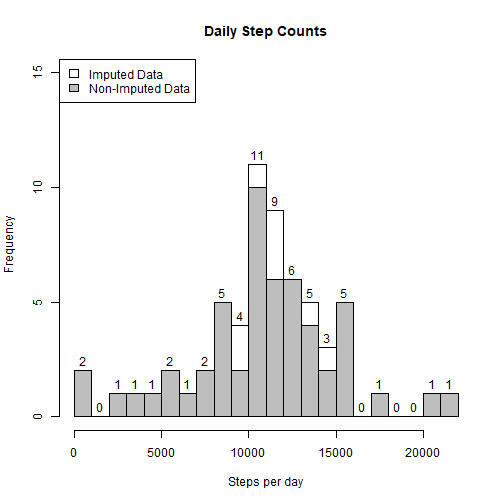
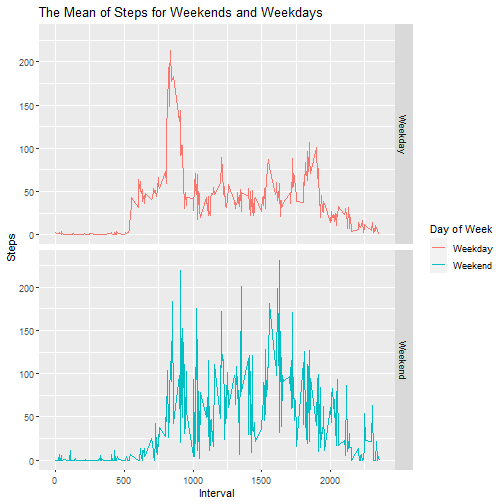

# LOADING AND PREPROCESSING THE DATA
The physical data will be retrieved from the specified url, unzipped and loaded into the variable. The data type of date from character is also converted into date class by using strptime function, it will also be useful in comparing the difference in activity patterns between weekdays and weekends. According to the data, there are 61 days of activity in this data set each with a 5 minute increment interval.

```r
dataurl <- "https://d396qusza40orc.cloudfront.net/repdata%2Fdata%2Factivity.zip"

if(file.exists("activity.zip")==F){
  download.file(dataurl,destfile="./activity.zip")
  unzip("activity.zip")
}
#Load the data read.csv()
importdata <- read.csv("activity.csv")
#Process/transform the data (if necessary) into a format suitable for your analysis.
importdata$date <- as.Date(importdata$date,format="%Y-%m-%d")
head(importdata)
```

```
##   steps       date interval
## 1    NA 2012-10-01        0
## 2    NA 2012-10-01        5
## 3    NA 2012-10-01       10
## 4    NA 2012-10-01       15
## 5    NA 2012-10-01       20
## 6    NA 2012-10-01       25
```
# WHAT IS THE MEAN OF STEPS TAKEN PER DAY?

```r
totalstepsperday <- aggregate(steps ~ date,importdata,FUN=sum,na.rm=TRUE)
plot(totalstepsperday,type="l")
```



```r
totalstepsperday$date[which(totalstepsperday$steps==min(totalstepsperday$steps))]
```

```
## [1] "2012-11-15"
```

```r
min(totalstepsperday$steps)
```

```
## [1] 41
```

```r
totalstepsperday$date[which(totalstepsperday$steps==max(totalstepsperday$steps))]
```

```
## [1] "2012-11-23"
```

```r
max(totalstepsperday$steps)
```

```
## [1] 21194
```

```r
#Calculate and report the mean and median of the total number of steps taken per day.
mean(totalstepsperday$steps)
```

```
## [1] 10766.19
```
Based on the data without the missing values. It states that for over two months we have the minimum steps in total in November 15, with 41 steps, the maximum steps in total is in November 15, with a 21194 number of steps, and the average or mean of 10766.19 in total number of steps.


```r
#If you do not understand the difference between a histogram and a barplot, research the difference between them. Make a histogram of the total number of steps taken each day
hist(totalstepsperday$steps,breaks = 20,xlab="Steps per day",main="Daily Step Counts",labels=T,ylim=c(0,12))
```


The histogram shows the frequency of the total steps per day.


# WHAT IS THE AVERAGE DAILY ACTIVITY PATTERN?

```r
meanstepsperincrement <- aggregate(steps ~ interval,importdata,FUN=mean,na.rm=T)
#Make a time series plot (i.e. \color{red}{\verb|type = "l"|}type = "l") of the 5-minute interval (x-axis) and the average number of steps taken, averaged across all days (y-axis)
plot(meanstepsperincrement,type="l",xlab="Interval",ylab="Steps",main="Steps per 5-minute Interval")
```



```r
#Which 5-minute interval, on average across all the days in the dataset, contains the maximum number of steps?
meanstepsperincrement$interval[which(meanstepsperincrement$steps==max(meanstepsperincrement$steps))]
```

```
## [1] 835
```

```r
max(meanstepsperincrement$steps)
```

```
## [1] 206.1698
```

Based on the data, we have the highest step per day with 206.1698 in 835 minutes. That is 13 hour and 54 minutes.

# IMPUTING MISSING VALUES


```r
#Calculate and report the total number of missing values in the dataset.
sum(is.na(importdata))
```

```
## [1] 2304
```

Based on our raw data, we have 2,304 missing values.


```r
if("mice" %in% installed.packages()==F){
  install.packages("mice")
}

library(mice)
#Devise a strategy for filling in the missing values in the data set.
imputeddata <- mice(importdata,m=5,maxit = 20)
```

```
## 
##  iter imp variable
##   1   1  steps
##   1   2  steps
##   1   3  steps
##   1   4  steps
##   1   5  steps
##   2   1  steps
##   2   2  steps
##   2   3  steps
##   2   4  steps
##   2   5  steps
##   3   1  steps
##   3   2  steps
##   3   3  steps
##   3   4  steps
##   3   5  steps
##   4   1  steps
##   4   2  steps
##   4   3  steps
##   4   4  steps
##   4   5  steps
##   5   1  steps
##   5   2  steps
##   5   3  steps
##   5   4  steps
##   5   5  steps
##   6   1  steps
##   6   2  steps
##   6   3  steps
##   6   4  steps
##   6   5  steps
##   7   1  steps
##   7   2  steps
##   7   3  steps
##   7   4  steps
##   7   5  steps
##   8   1  steps
##   8   2  steps
##   8   3  steps
##   8   4  steps
##   8   5  steps
##   9   1  steps
##   9   2  steps
##   9   3  steps
##   9   4  steps
##   9   5  steps
##   10   1  steps
##   10   2  steps
##   10   3  steps
##   10   4  steps
##   10   5  steps
##   11   1  steps
##   11   2  steps
##   11   3  steps
##   11   4  steps
##   11   5  steps
##   12   1  steps
##   12   2  steps
##   12   3  steps
##   12   4  steps
##   12   5  steps
##   13   1  steps
##   13   2  steps
##   13   3  steps
##   13   4  steps
##   13   5  steps
##   14   1  steps
##   14   2  steps
##   14   3  steps
##   14   4  steps
##   14   5  steps
##   15   1  steps
##   15   2  steps
##   15   3  steps
##   15   4  steps
##   15   5  steps
##   16   1  steps
##   16   2  steps
##   16   3  steps
##   16   4  steps
##   16   5  steps
##   17   1  steps
##   17   2  steps
##   17   3  steps
##   17   4  steps
##   17   5  steps
##   18   1  steps
##   18   2  steps
##   18   3  steps
##   18   4  steps
##   18   5  steps
##   19   1  steps
##   19   2  steps
##   19   3  steps
##   19   4  steps
##   19   5  steps
##   20   1  steps
##   20   2  steps
##   20   3  steps
##   20   4  steps
##   20   5  steps
```

```r
#Create a new data set that is equal to the original data set but with the missing data filled in.
cleandata <- complete(imputeddata)
```

```r
sum(is.na(cleandata))
```

```
## [1] 0
```
We use the mice package to impute the missing values and created a new dataset named clean values, where there is no NA values stored in.


```r
totalstepsperdayimp <- aggregate(steps ~ date,cleandata,FUN=sum,na.rm=TRUE)
plot(totalstepsperday,type="l",xlab="",ylab="Steps",main="Steps per day of the raw dataset",col="blue")
```



```r
plot(totalstepsperdayimp,type="l",xlab="",ylab="Steps",main="Steps per day of the new dataset",col="darkgreen")
```



```r
hist(totalstepsperday$steps,breaks = 20,xlab="Steps per day",main="Daily Step Counts (raw)",labels=T,ylim=c(0,15))
```



```r
hist(totalstepsperdayimp$steps,breaks = 20,xlab="Steps per day",main="Daily Step Counts (imputted)",labels=T,ylim=c(0,15))
```




```r
hist(totalstepsperdayimp$steps,breaks = 20,xlab="Steps per day",main="Daily Step Counts",labels=T,ylim=c(0,15),col="white")
hist(totalstepsperday$steps,breaks = 20,xlab="Steps per day",ylim=c(0,15),col="grey",add=T)
legend("topleft",c("Imputed Data","Non-Imputed Data"),fill=c("white","grey"))
```



```r
mean(totalstepsperdayimp$steps)
```

```
## [1] 10882.11
```

```r
median(totalstepsperdayimp$steps)
```

```
## [1] 11015
```
This is to compare the two dataset which is the raw and the new one, to answer the question of number of steps taken each day.The impact of imputing missing data is that we can now easily predict to answer our question easily, having missing values in our data set reduces the chance that our models will be that accurate for our analysis.


# ARE THERE DIFFERENCES IN ACTIVITY PATTERNS BETWEEN WEEKDAYS AND WEEKENDS

```r
if("ggplot2" %in% installed.packages()==F){
  install.packages("ggplot2")
}
library("ggplot2")
cleandata$dayOfWeek <- "Weekday"
#Create a new factor variable in the dataset with two levels – “weekday” and “weekend” indicating whether a given date is a weekday or weekend day.
cleandata$dayOfWeek[weekdays(cleandata$date) == c("Saturday","Sunday")] <- "Weekend"
cleandata$dayOfWeek <- as.factor(cleandata$dayOfWeek)
aggregatedData <- aggregate(steps~interval + dayOfWeek, cleandata,na.rm=T,FUN=mean)
#Make a panel plot containing a time series plot (i.e. \color{red}{\verb|type = "l"|}type = "l") of the 5-minute interval (x-axis) and the average number of steps taken, averaged across all weekday days or weekend days (y-axis). See the README file in the GitHub repository to see an example of what this plot should look like using simulated data.
ggplot(data=aggregatedData,aes(x=interval,y=steps,fill=dayOfWeek,col=dayOfWeek)) + 
  geom_line() +
  xlab("Interval") +
  facet_grid(dayOfWeek~.)+
  ylab("Steps") +
  ggtitle("The Mean of Steps for Weekends and Weekdays") +
  labs(col="Day of Week")
```




